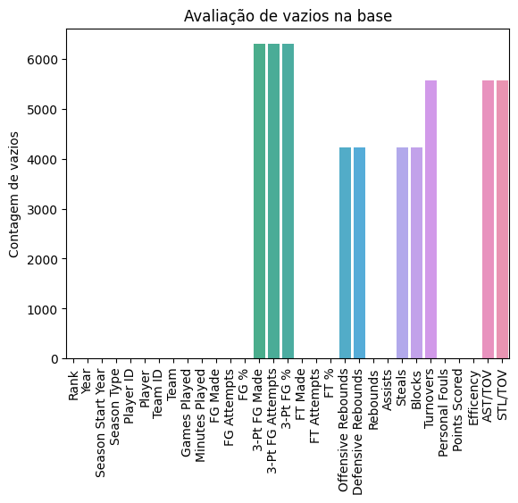
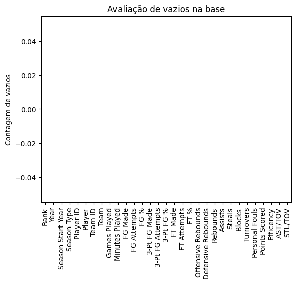

# Tratamento dos Dados
Para analisar os perfis de usuário da NBA, Pandas será usados para carregar o conjunto de dados em um DataFrame para que possa ser explorado e visualizado com Python.

Existem algum valores vazios o que é um problema para as análises que serão feitas. Vamos conferir quantas linhas do dataset existem esse tipo de dados.

O DataFrame apresenta valores nulos em algumas colunas, como 3-Pt FG Made, 3-Pt FG Attempts, 3-Pt FG %, Offensive Rebounds, Defensive Rebounds, Steals, Blocks, Turnovers, AST/TOV e STL/TOV. Esses valores nulos podem indicar a ausência de dados ou informações faltantes para algumas estatísticas específicas dos jogadores em determinadas temporadas.

Para manter a consistência e garantir a confiabilidade da análise, optou-se por filtrar o DataFrame, excluindo as temporadas anteriores a 1978. Dessa forma, as colunas mencionadas estarão preenchidas a partir desse ano, permitindo uma análise mais completa e precisa das estatísticas dos jogadores da NBA.

Essa decisão foi tomada para evitar distorções nos resultados devido à ausência de dados em períodos anteriores, garantindo que a análise seja baseada em informações mais completas e recentes.

