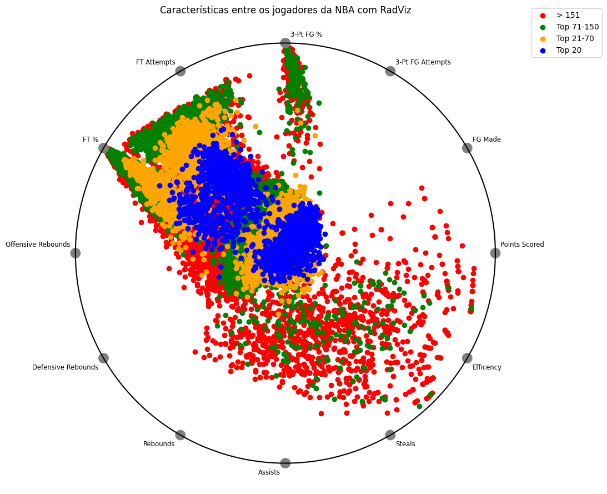

# O que define um jogador bom?

Para simplificação, será utilizado o rank apresentado no dataset, que representa a ordenação dos jogadores de acordo com a pontuação por temporada. Apesar desse rank não levar em consideração fatores defensivos, será feita uma avaliação para verificar se os maiores "cestinhas" também apresentam características defensivas acima da média. Em um primeiro momento, será avaliado como as informações estatísticas de cada jogador por temporada variam e como estão relacionadas com o rank. Para isso, será utilizada a técnica do PCA para entender melhor esse comportamento.

Para definir o número ideal de componentes, avaliou-se a variância explicada por cada componente e utilizou-se a regra do cotovelo. Observando o gráfico abaixo, pode-se notar que a partir da segunda componente, quase toda a variância é explicada. Portanto, duas componentes são suficientes para descrever os dados, além de facilitar a interpretação visual dos mesmos.

{width="361"} Na primeira análise do PCA, é possível observar que as variáveis são capazes de separar os jogadores com melhor ranking. Além disso, o ranking pode seguir três caminhos distintos, todos com a variável "eficiência" como a principal, mas com um foco maior em cestas de dois pontos, outro em cestas de três pontos, e por fim, um focado em rebotes e bloqueios. Esse último é especialmente relevante para jogadores nas posições de pivô e ala-pivô. Além disso, nota-se a presença de muitas variáveis correlacionadas. Para análises futuras, serão removidas as variáveis com maior correlação e menor peso no PCA.

{width="488"}

{width="483"}

A matriz de correlação gerada apresenta os coeficientes de correlação entre diferentes variáveis. Os valores na matriz variam de -1 a 1 e indicam a força e direção do relacionamento entre as variáveis.

Aqui estão algumas observações com base na matriz de correlação:

-   Há uma correlação positiva forte entre "Games Played" e várias outras variáveis, como "Minutes Played", "FG Made", "FG Attempts", "FT Made" e "FT Attempts". Isso faz sentido, uma vez que jogadores que disputam mais partidas tendem a acumular mais minutos de jogo e ter mais tentativas e acertos em arremessos de quadra e lances livres.

-   Existe uma correlação positiva forte entre "Offensive Rebounds" e "Defensive Rebounds", o que é esperado, já que ambos contribuem para o número total de rebotes.

-   Há uma correlação positiva forte entre "Points Scored" e várias outras variáveis, como "FG Made", "FT Made" e "Minutes Played". Isso indica que jogadores que marcam mais pontos também tendem a converter mais arremessos de quadra, lances livres e jogar por mais minutos.

{width="50%"}

Para corroborar com a avaliação do PCA foi utilizada uma outra técnica a fim de verificar o poder de separação dos atributos da base, as Curvas de Andrews. Elas são úteis porque permitem identificar quais variáveis têm um maior impacto na separação dos grupos, ajudando a entender a importância relativa de cada característica. Além disso, elas também podem ser usadas para detectar a presença de outliers ou padrões incomuns nos dados.

As Curvas de Andrews são construídas utilizando a série de Fourier para transformar as variáveis originais em uma combinação de funções seno e cosseno. A série de Fourier é uma representação matemática de uma função periódica como uma soma infinita de funções seno e cosseno com diferentes frequências.

A fórmula da série de Fourier utilizada para construir as Curvas de Andrews é a seguinte:

Fórmula de Fourier para Curvas de Andrews

$\ f(x) = \frac{a_0}{2} + \sum_{n=1}^{\infty} \left( a_n \cos(nx) + b_n \sin(nx) \right)$

Nesta fórmula, f(x) representa a função que descreve a curva de Andre para uma determinada variável. Os coeficientes a_0, a_n e b_n são calculados com base nos dados originais e representam a amplitude e a fase das funções seno e cosseno em diferentes frequências.

Para cada variável do conjunto de dados, a série de Fourier é aplicada e os coeficientes a_0, a_n e b_n são determinados. Em seguida, as séries de Fourier são somadas para criar a curva de Andrews para cada grupo no conjunto de dados.

Essa abordagem permite representar as variáveis em termos de frequências harmônicas, revelando padrões e relações entre elas. As Curvas de Andrews resultantes são plotadas em um gráfico para visualização e análise da separação entre os grupos.

A interpretação das Curvas de Andrews é baseada na análise da forma das curvas e na distância entre elas. Se as curvas de diferentes grupos estão próximas umas das outras, isso indica que as variáveis têm um poder de separação menor. Por outro lado, se as curvas estão bem separadas, isso sugere que as variáveis têm um alto poder de separação entre os grupos.

Quando é observada a curva, é possível notar que as variáveis selecionadas no PCA apresentam uma boa separação entre os grupos top 20,top 21-70, 71-150 e maior que 150, indicando que esses atributos separam bem não somente os melhores jogadores, como destacados no PCA, mas também entre jogadores menos bem ranqueados.

{width="50%"}

Por fim, a última avaliação dos jogadores foi realizada utilizando a técnica Radviz. Essa técnica é utilizada para visualizar dados multivariados. Consiste em um gráfico circular no qual os pontos de dados são dispostos ao redor de um círculo, sendo a posição de cada ponto determinada pelas suas variáveis. Cada variável é representada por um eixo radial, e a localização do ponto no gráfico indica a contribuição relativa de cada variável para o ponto de dados. Dessa forma, o Radviz permite identificar padrões e relacionamentos entre as variáveis de maneira intuitiva e compacta.

No caso da NBA, uma propriedade interessante é quando um jogador se destaca em vários atributos, ele ficará mais próximo do centro do círculo, enquanto jogadores que se destacam mais em um atributo específico tenderão a se afastar do centro.

Ao observar os top 20 jogadores, é possível notar que eles estão mais concentrados ao centro, indicando que seus atributos não se limitam a uma habilidade específica, mas apresentam resultados razoáveis em todos os atributos. Além disso, à medida que o ranking aumenta, os pontos se dispersam ao longo do círculo, indicando a presença de valores mais extremos.

Em resumo, de acordo com o Radviz, pode-se concluir que para ser considerado um bom jogador na NBA, não basta ser o principal pontuador, mas é necessário se destacar de maneira considerável em outros aspectos, como defesa, rebotes, variedade de arremessos e assistências.

{width="50%"}

# Evolução do jogo ao longo do tempo.

Ao avaliar o Radviz aberto por ano e temporada (regular e playoffs), é possível chegar a algumas conclusões:

-   Na década de 80/90, os arremessos de três pontos eram menos frequentes, e isso pode ser observado pela menor variação nos dados relacionados a essas estatísticas. As âncoras 3-pt FG%, 3Pt FG Attempts e 3-pt FG Made não apresentam uma tendência clara. No entanto, nas décadas seguintes, há uma dispersão maior dos dados nessas âncoras, indicando uma maior importância e frequência dos arremessos de três pontos.

-   Os dados são mais dispersos na temporada regular do que nos playoffs, tornando mais difícil uma separação clara entre os jogadores mais bem ranqueados, especialmente nos top 150.

-   Nos playoffs, a dispersão dos dados é menor, permitindo uma melhor separação dos top 20 jogadores. É importante notar que alguns extremos podem ser encontrados entre os jogadores até o top 150, o que não ocorre na temporada regular.

-   Os top 20 jogadores da NBA, independentemente do ano ou da temporada, apresentam uma característica consistente: eles são constantes em todos os indicadores, sem apresentar extremos significativos.

Um exemplo disso é Stephen Curry, que é conhecido por seus arremessos de três pontos e sempre possui um alto ranking. No entanto, ele se mantém próximo ao centro no Radviz, indicando que ele também é bem avaliado em outros aspectos do jogo.

Essas observações mostram que a consistência e o desempenho equilibrado em várias estatísticas são características importantes para os jogadores de destaque na NBA.

{width="50%"}
