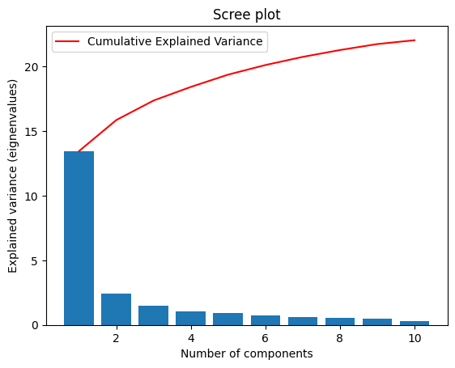
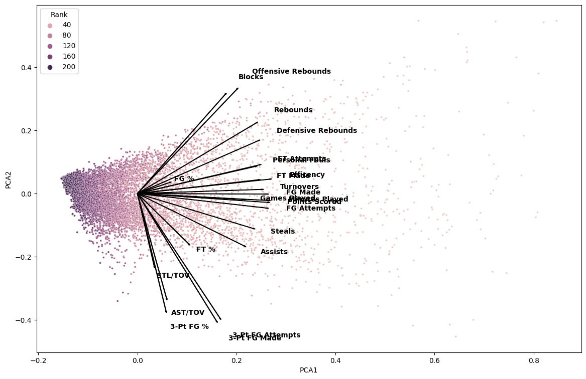
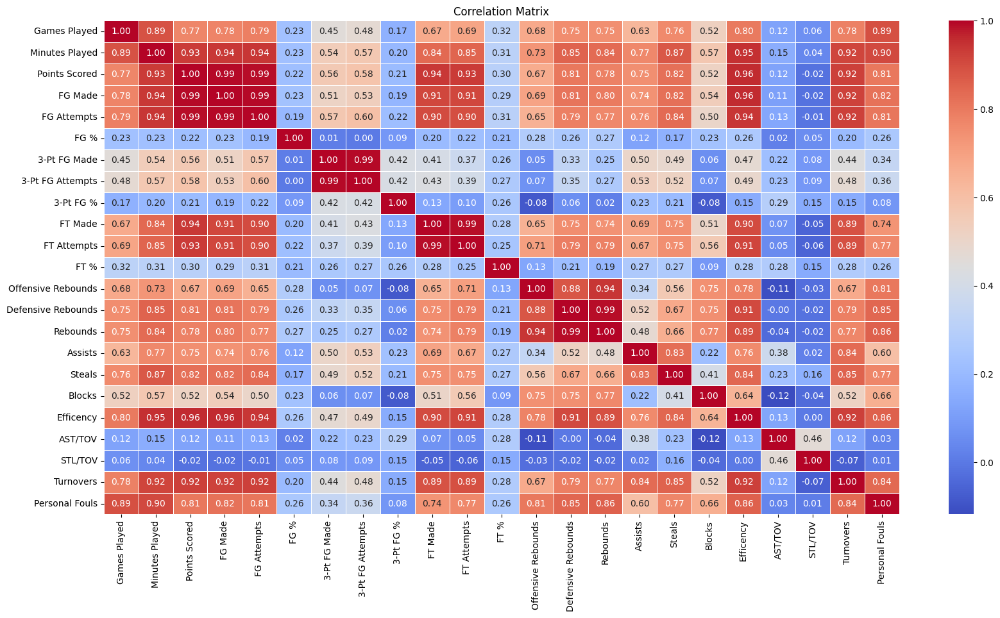
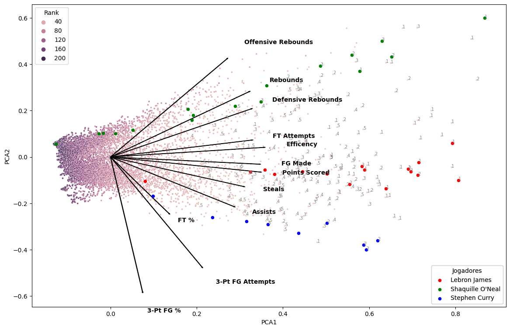
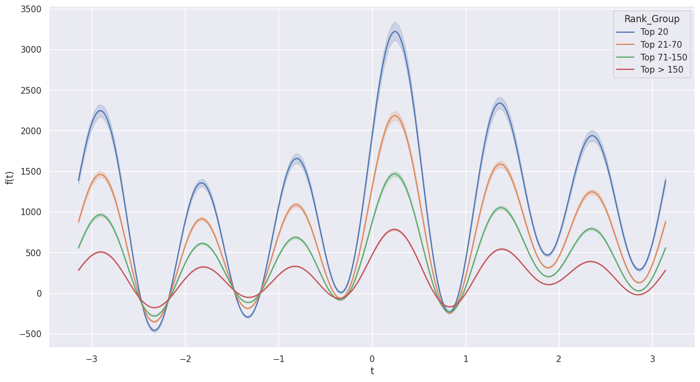
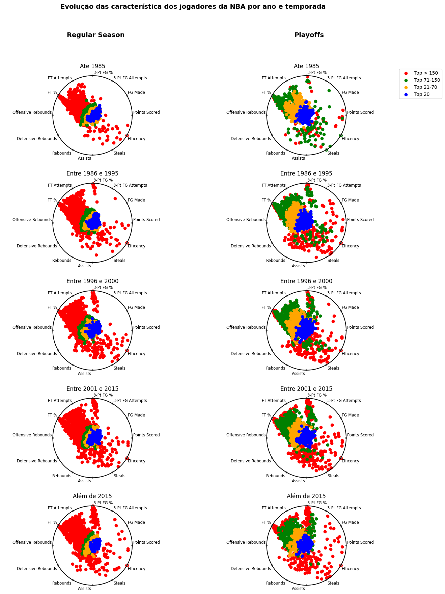

# O que define um jogador bom ?

Para simplificação vamos utilizar o rank apresentado no dataset, que seriam os jogadores ordenados de acordo com a pontuação por temporada.

Apesar dessa rank não levar em consideração fatores defensivos, será feito uma avaliaçào se os maiores "cestinhas" também apresentam características defensivas acima da média.

A primeiro momento vamos avaliar como as informações estatísticas de cada jogador por temporada varia e como está relacionado com o rank. Para tanto será utiizado a técnica do PCA para entender melhor esse comportamento.

Para definir o número de componentes ideal foi availiada a variância explicada por cada componente e adotada a regra do cotovelo.

Pelo gráfico abaixo a partir da segunda componente já é explicada quase toda variância, sendo duas componentes suficiente para ter uma descrição dos dados, além de uma maior facilidade de interpretação visual dos dados.

 Na primeira análise do PCA é possível notar que as variáveis conseguem separar os jogadores mais bem ranqueados. Além disso, esse ranque pode seguir por três caminhos, todos com a variável eficiência sendo a principal, mas um mais voltado para cestas de dois, outros de três e por fim um voltado rebotes e bloqueios. Esse último principalmente para jogadores na função de pivôs e alas-pivôs.

Além disso, é possível notar que existem muitas variáveis correlacionadas, para futuras análises serão retiradas as que tiverem maior correlação e menor peso no PCA.

A matriz de correlação gerada mostra os coeficientes de correlação entre diferentes variáveis. Os valores na matriz variam de -1 a 1 e indicam a força e direção do relacionamento entre as variáveis.

Aqui estão algumas observações a partir da matriz de correlação:

Há uma forte correlação positiva entre "Games Played" e diversas outras variáveis como "Minutes Played", "FG Made", "FG Attempts", "FT Made" e "FT Attempts". Isso faz sentido, pois jogadores que jogam mais partidas tendem a acumular mais minutos e ter mais tentativas e sucessos em arremessos de quadra e lances livres.

Existe uma forte correlação positiva entre "Offensive Rebounds" e "Defensive Rebounds", o que é esperado, já que ambos contribuem para o número total de rebotes.

Há uma forte correlação positiva entre "Points Scored" e diversas outras variáveis como "FG Made", "FT Made" e "Minutes Played".  Isso indica que jogadores que marcam mais pontos também tendem a converter mais arremessos de quadra, lances livres e atuam por mais minutos.

Após a redução de dimensionalidade é possível notar que ainda as estatísticas apresentam uma separação razoável na determinação do rank dos jogadores. Aliás, os maiores ranques são pontos bem distante do centroide. Na figura abaixo foi destacado os top 5 jogadores de cada temporada, além de trazer um exemplo para três jogadres: Lebron James, Shaquille O'Neal e Stephen Curry.

Interessante na avaliação dos três como o Curry se destaca pelas cestas dos três, O'Neal pela presença no garrafão, com elevado número de rebotes e o Lebron com uma das maiores eficiências já vistas na história da NBA.

Em resumo, para definição de um jogador bom é necessário uma maior eficiência como um todo, sendo que essa pode desviar de acordo com a posição e característica dos jogadores, seja sendo um armador com facilidade em cestas de 3 (Curry), um ala-pivô com característica mais equilibradas (Lebron) ou um pivô com uma presença no garrafão (O'Neal).

Por fim, mesmo o ranque utilizado ser de acordo com a pontuação, nota-se que os mais bem ranqueados nesse quesito não se destacam apenas por essa característica.

Para corroborar com a avaliação do PCA foi utilizada uma outra técnica a fim de verificar o poder de separação dos atributos da base, as Curvas de Andrews. Elas são úteis porque permitem identificar quais variáveis têm um maior impacto na separação dos grupos, ajudando a entender a importância relativa de cada característica. Além disso, elas também podem ser usadas para detectar a presença de outliers ou padrões incomuns nos dados.

As Curvas de Andrews são construídas utilizando a série de Fourier para transformar as variáveis originais em uma combinação de funções seno e cosseno. A série de Fourier é uma representação matemática de uma função periódica como uma soma infinita de funções seno e cosseno com diferentes frequências.

A fórmula da série de Fourier utilizada para construir as Curvas de Andrews é a seguinte:

Fórmula de Fourier para Curvas de Andrews

$\ f(x) = \frac{a_0}{2} + \sum_{n=1}^{\infty} \left( a_n \cos(nx) + b_n \sin(nx) \right)$

Nesta fórmula, f(x) representa a função que descreve a curva de Andre para uma determinada variável. Os coeficientes a_0, a_n e b_n são calculados com base nos dados originais e representam a amplitude e a fase das funções seno e cosseno em diferentes frequências.

Para cada variável do conjunto de dados, a série de Fourier é aplicada e os coeficientes a_0, a_n e b_n são determinados. Em seguida, as séries de Fourier são somadas para criar a curva de Andrews para cada grupo no conjunto de dados.

Essa abordagem permite representar as variáveis em termos de frequências harmônicas, revelando padrões e relações entre elas. As Curvas de Andrews resultantes são plotadas em um gráfico para visualização e análise da separação entre os grupos.

A interpretação das Curvas de Andrews é baseada na análise da forma das curvas e na distância entre elas. Se as curvas de diferentes grupos estão próximas umas das outras, isso indica que as variáveis têm um poder de separação menor. Por outro lado, se as curvas estão bem separadas, isso sugere que as variáveis têm um alto poder de separação entre os grupos.

Quando é observada a curva, é possível notar que as variáveis selecionaas no PCA apresentam uma boa separação entre os grupos top 20,top 21-70, 71-150 e maior que 150, indicando que esses atributos separam bem não somente os melhores jogadores, como destacados no PCA, mas também entre jogadores menos bem ranqueados.

Por fim a última avaliação para os jogadores foi utilizando a técnica Radviz. Ele é um método de visualização utilizado para representar dados multivariados. Ele consiste em um gráfico circular no qual os pontos de dados são dispostos em torno de um círculo, sendo a posição de cada ponto determinada pelas suas variáveis. Cada variável é representada por um eixo radial, e a localização do ponto no gráfico indica a contribuição relativa de cada variável para o ponto de dados. Dessa forma, o Radviz permite identificar padrões e relacionamentos entre as variáveis de forma intuitiva e compacta.

Para o caso da NBA, uma propriedade interessante é quando um jogador se destaque em vários atributos, ele ficará mais ao centro do círculo, enquanto jogadores que se destacam mais por algum atributo específico tenderam a essa âncora.

Quando é observado os top 20 jogadores, é possível notar que estão mais concentrados ao centro, indicando que seus atributos não se limitam a uma habilidade específica, mas a apresentar um resultado razoável em todos os atributos. Além disso, conforme o ranque vai aumentando, os pontos vão ficando mais dispersos ao longo do círculo, indicando algum valor mais extremo.

Em resumo pelo Radviz, pode-se concluir que para ser bom na NBA não basta ser o cestinha, mas se destacar de maneira considerável em outros quesitos, como defesa, rebotes, variação de arremesos e assistências.

# Evolução do jogo ao longo dos tempos e temporadas.

Ao avaliar o Radviz aberto por ano e temporada (regular e playoffs), é possível obter algumas conclusões:

-   Na década de 80/90 os chutes de 3 eram menos frequentes. A variação desses dados é bem menor nesse período. É possível verificar essa análise ao avaliar as âncoras 3-pt FG%, 3Pt FG Attempts e 3-pt FG Made, os quais não apresentam quase nenhum indicador tendendo a eles. Diferentemente das próximas décadas em que há uma dispersão bem maior tendendo a essas âncoras.
-   As informações são bem mais dispersas na temporada regular que nos playoffs, logo é mais difícil ter uma separação entre os jogares mais bem ranqueados, principalmente nos top 150.
-   Nos playoffs a dispersão dos dados é menor, sendo possível obter uma melhor separação para os top 20 jogadores. Importante notar que alguns extremos são jogadores até top 150, fato que não acontece na temporada regular.
-   Os top 20 jogadores da NBA, independente do ano ou da temporada sempre apresentam uma característica bem definida: são constante em todos indicadores, sem apresentar extremos.
-   Um exemplo disso é o Stephen Curry, muito conhecido pelos arremessos de 3 pontos, sempre bem ranqueado, porém se mantém próximo ao centro, uma vez que também é bem avaliado nos outros quesitos.

