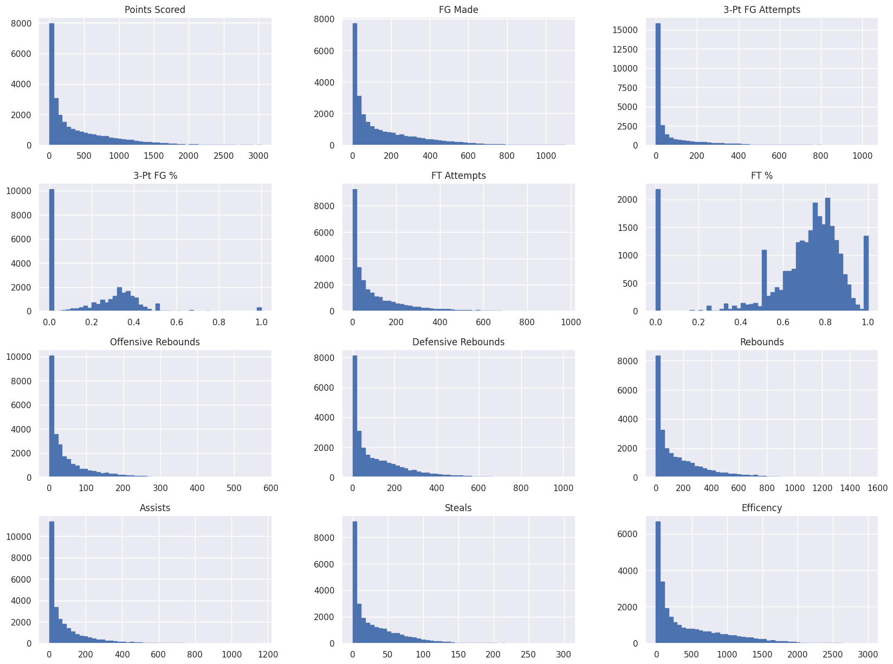
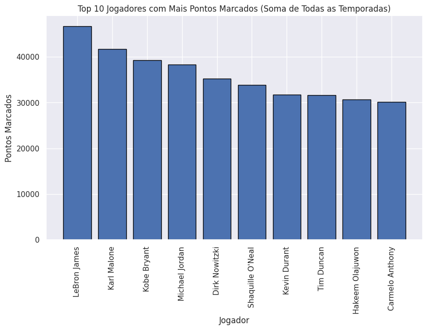
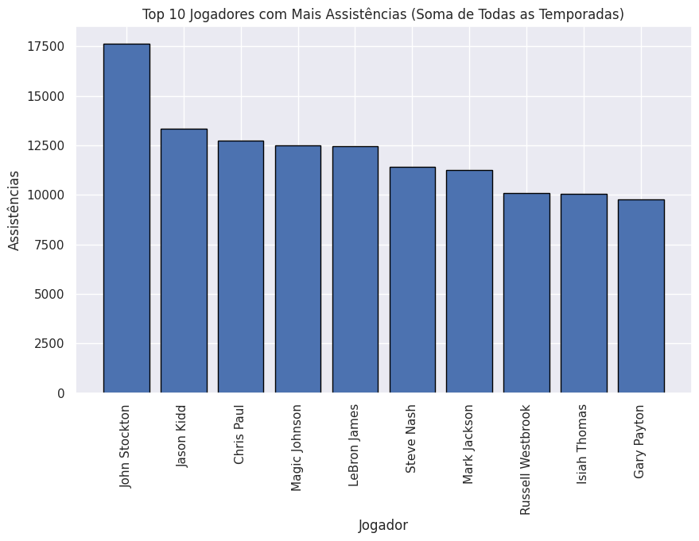
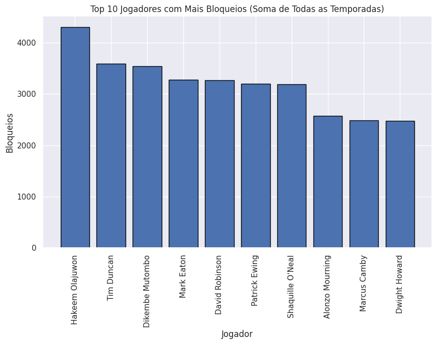
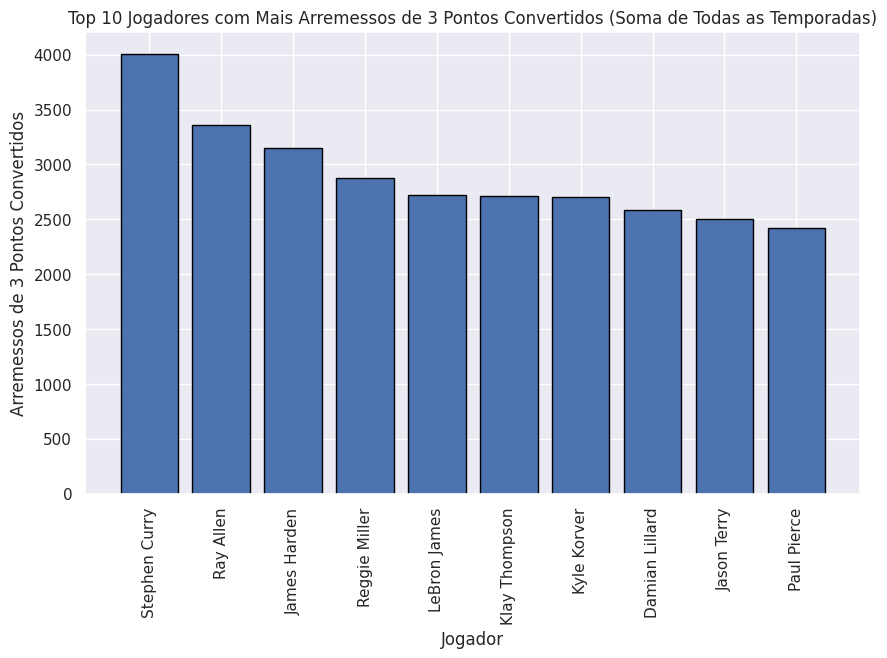

# Entendimento das principais estatísticas do jogo

Uma maneira simples de entender melhor como funciona um jogo de basquete e como são os jogadores é avaliar as distribuições dos principais atributos. Quando os atributos estão relacionados a marcar mais pontos, fazer mais arremessos ou ter mais roubadas de bola, todos eles apresentam uma forma de distribuição exponencial. Isso indica que, à medida que a frequência desses atributos aumenta, uma quantidade menor de jogadores consegue atingir marcas mais altas.

Além disso, é possível interpretar a forma como essas curvas de distribuição decrescem. Ao comparar os arremessos de três pontos com os arremessos de dois pontos, a curva dos arremessos de três apresenta uma queda mais acentuada. Isso indica que esse é um atributo com menor frequência (ou maior dificuldade). A mesma analogia pode ser aplicada aos rebotes ofensivos e defensivos, sendo que os rebotes ofensivos são muito menos frequentes.

Por fim, os atributos relacionados aos percentuais de acerto de arremessos de três pontos ou lances livres se assemelham a uma distribuição normal. Isso indica a característica do percentual de acerto de cada jogador. É importante destacar que a média de acertos em arremessos de três pontos é em torno de 35%, enquanto nos lances livres é de 80%. Isso evidencia a maior dificuldade de acerto em arremessos de três pontos. Essas observações nos ajudam a compreender melhor como os jogadores se destacam em diferentes aspectos do jogo e como as estatísticas se distribuem entre eles.

{width="90%"}

{width="90%"}

{width="90%"}

{width="90%"}

{width="90%"}
