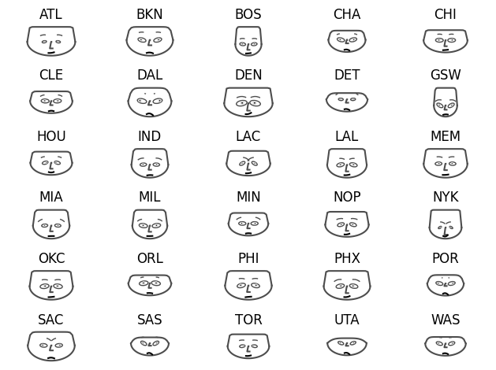
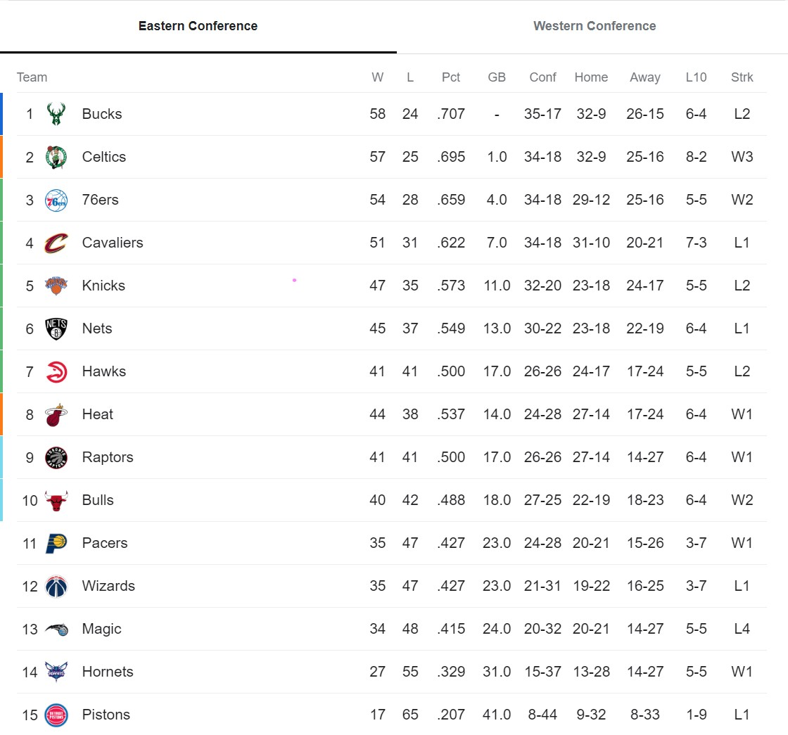
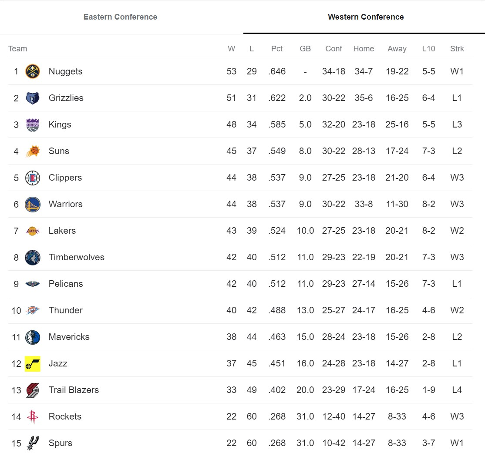
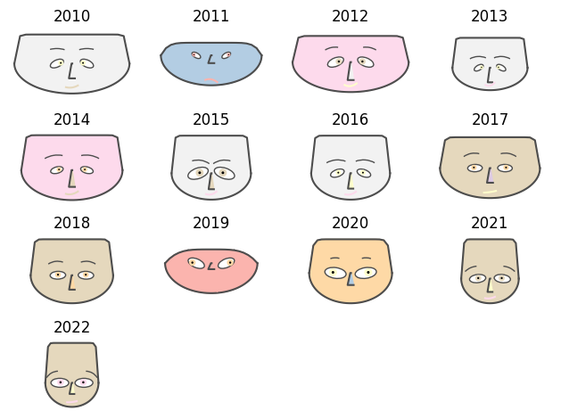

# Inspiração para novas análises

Últimos campeões e vices da NBA:

2013 - San Antonio Spurs \| Miami Heat

2014 - Golden State **Warriors** \| Cleveland Cavaliers

2015 - Cleveland Cavaliers \| Golden State **Warriors**

2016 - Golden State **Warriors** \| Cleveland Cavaliers

2017 - Golden State **Warriors** \| Cleveland Cavaliers

2018 - Toronto Raptors \| Golden State **Warriors**

2019 - Los Angeles Lakers \| Miami Heat

2020 - Milwaukee Bucks \| Phoenix Suns

2021 - Golden State **Warriors** \| Boston Celtics

2022 - Denver Nuggets \| Miami Heat

O método de visualização Chernoff Faces é uma técnica poderosa para representar múltiplas variáveis ​​simultaneamente através de faces humanas estilizadas. Desenvolvido por Herman Chernoff em 1973, essa abordagem inovadora transforma dados complexos em características faciais, permitindo ao observador identificar rapidamente padrões e correlações entre as variáveis. No presente artigo, explora-se o funcionamento do método Chernoff Faces, destacando sua aplicação na base de dados da NBA e discutindo suas vantagens e limitações como ferramenta de visualização de dados.

As faces de Chernoff são estruturadas de forma a representar cada variável por meio de atributos específicos, que são codificados visualmente nas características faciais. Cada face é dividida em regiões distintas, cada uma correspondendo a uma variável. Por exemplo, o tamanho dos olhos pode representar uma variável, a inclinação da boca pode representar outra, e assim por diante. Além disso, os atributos das características faciais são cuidadosamente calibrados para variar de acordo com os valores das variáveis, tornando a representação visual mais intuitiva. Dessa forma, alterações nas características das faces refletem as mudanças nos valores das variáveis correspondentes, facilitando a compreensão dos padrões e relações presentes nos dados. A simplicidade e a capacidade de processamento visual eficiente tornam as Chernoff Faces uma ferramenta valiosa em análise exploratória de dados e na comunicação de informações complexas para um público amplo.

Na análise dos desempenhos das equipes, percebe-se uma interessante disparidade entre os Indiana Pacers (IND) e o Washington Wizards (WAS), que, apesar de terem alcançado resultados iguais, apresentam características distintas em suas representações nas faces de Chernoff. Esta discrepância pode ser atribuída a uma variedade de fatores, incluindo o estilo de jogo, as estratégias táticas adotadas, bem como as individualidades dos jogadores em cada equipe.

Por outro lado, chama atenção a semelhança nas representações faciais entre o Miami Heat (MIA) e o Milwaukee Bucks (MIL). Embora visualmente parecidos nesse contexto específico, o desempenho na temporada os colocou em posições distantes na tabela, o que sugere que outros aspectos além das características individuais dos jogadores podem ter influenciado seus resultados, como lesões, adversários enfrentados e efetividade em partidas decisivas.

Além disso, a análise também aponta para situações em que times com o mesmo número de vitórias podem ter performances completamente diferentes. Isso pode ocorrer quando a média de pontos nas vitórias é significativamente diferente entre as equipes, revelando variações em suas abordagens ofensivas e defensivas. Além disso, há casos em que algumas equipes conquistam vitórias com margens mínimas e, em contraste, sofrem derrotas com grandes diferenças de pontos. Essas variações podem ser um reflexo da consistência e da capacidade de reação das equipes em diferentes situações de jogo.

Em suma, a análise das características dos jogadores em diferentes equipes utilizando as faces de Chernoff é uma ferramenta útil para identificar padrões e tendências nos desempenhos das equipes. No entanto, é importante ressaltar que o basquete é um esporte complexo, influenciado por diversos fatores, e que apenas a análise visual não é suficiente para compreender completamente as dinâmicas e resultados das partidas.

Ao analisar os Warriors (GSW) ao longo de 13 anos usando as faces de Chernoff, é possível notar algumas tendências interessantes e reveladoras.\
Por exemplo, durante os anos de 2014 e 2015, em que o time foi campeão, os rostos apresentaram diferenças significativas, tais como largura, tamanho dos olhos e ângulo das sobrancelhas. Isso pode refletir mudanças no elenco, táticas de jogo ou até mesmo fatores externos que influenciaram o desempenho da equipe.\
Por outro lado, de 2021 para 2022, os rostos dos jogadores praticamente não mudaram, apesar de terem terminado em posições diferentes no final do Campeonato. Esse fato pode indicar uma relativa estabilidade na equipe em relação aos jogadores ou estratégias utilizadas nesses períodos, apesar das variações no resultado final.\
Notavelmente, a mesma 4ª posição ocupada em 2011 resultou em um rosto bem diferente em comparação com os anos em que foram campeões. Isso pode sugerir que, apesar da colocação na tabela, o desempenho geral da equipe pode ter sido diferente em relação às temporadas em que foram campeões.\
É importante destacar que o resultado final de um campeonato não conta toda a história sobre a temporada, especialmente quando se trata do desempenho dos jogadores. As partidas podem ser decididas por margens mínimas, e um time que terminou a temporada regular em uma posição aparentemente desvantajosa pode surpreender e chegar à final, mostrando a importância do desempenho ao longo do campeonato, não apenas na fase final.\
Nesse contexto, os gráficos das faces de Chernoff, assim como outras ferramentas analíticas, são elementos essenciais para uma análise mais abrangente e para contar a história completa. Eles fornecem insights valiosos sobre as tendências e mudanças ao longo do tempo, mas isoladamente não conseguem oferecer respostas definitivas. Assim como um jogador precisa do trabalho em equipe para ganhar um campeonato, as análises devem ser integradas e contextualizadas para uma compreensão mais completa do desempenho de um time de basquete ao longo dos anos.

Últimas posições na temporada regular do Golden State Warriors:

2010 - 3º

2011 - 4º

2012 - 2º

2013 - 2º

2014 - 1º

2015 - 1º

2016 - 1º

2017 - 1º

2018 - 1º

2019 - 5º

2020 - 4º

2021 - 2º

2022 - 4º
